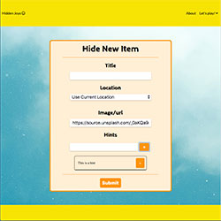
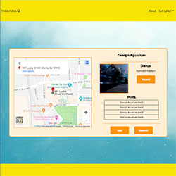
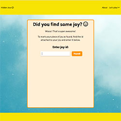
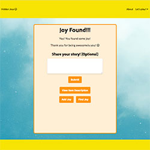
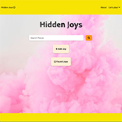

# Hidden Joys

## About
Hidden Joys was made for people who want to share a little piece of positivity in the world by creating a mini piece of art or a kind note/message and hiding it out there for someone else to find.

We believe in creating joy for others by lifting them up, putting a smile on their faces, and having a little fun in the process! 

## Contributors  
- Liz Khuu
- Clint Urbin

## Technologies Used  
- HTML, CSS, JavaScript, Node.js, Express, PostgreSQL, React, Redux, Google Maps API, Amazon Web Services

## Key Features
- Users can hide new items
- Users can search for hidden items
- Users can view individual item details
- Users can mark an item found

## Features in Detail  
- USERS CAN HIDE NEW ITEMS:  
    - When a user wants to hide a new item, they fill out a form which includes an item title, location, image and list of hints. The user can either use their current location or search for an address using the Google Places Library. The user can also add new hints by typing the hint in the input box and clicking the add button. This will then display the newly entered hint in a listing below the input box. After the user has entered a hint they will have the ability to remove the hint from the list by clicking the remove button. Also, the user will not be able to submit a new item form without including at least one hint. If they try to submit a form without any hints they will get a message asking them to include a hint.  

        After the user submits the form, they are directed to a screen thanking them for their submission. They are also given an id to include with their item so whoever finds the item can report that they found it. 

       
    
- USERS CAN SEARCH FOR HIDDEN ITEMS:  
    - Another key feature of this application is the ability for users to search for hidden items. On the search screen users will see a map with markers representing hidden items. As a default, the location for the map is set to Atlanta, GA. This will change when the user selects a location to search. Like the add item screen, users can choose to either search for hidden items by their current location or by selecting a place in the Seach Places input box, which is linked to the Google Places library.  
    
        Users are also able to filter the displayed markers by selecting All, Not Found, or Found. So, if someone just wants to see which items are still hidden, they select Not Found and the map will just display the items that are still hidden.  
        
        The search screen also has buttons to allow the user to add new items or report that an item has been found.  
    
      

- USERS CAN VIEW ITEM DETAILS:  
    - The Item Details page displays the item's title, an image, the found status, a list of hints to help people find the item, and a map for the item.

        If the item is still hidden, the Status will say, "Item still hidden!" and there will be a button that opens the found items form. If an item has been found, the status will say, "Item Found!" Also, if there was a comment left by the person who found the item, it will be displayed here.  

        The map on the Item Details page shows a marker for only that item. Also, when you click on 'More Options,' Google Directions opens in a new tab pointing the user to the items location.  

      

- USERS CAN MARK ITEMS AS FOUND:  
    - When someone finds an item out in the world, there should be an id included with it. The user can enter this id in the Found Item Form. If someone enters an invalid id, they will see a message that says, "Invalid Id." If someone enters an id for an item that has already been found, they will see a message that says, "Item has already been found" and will see a button that opens the detail page for that item.  

        When someone enters a correct id for a hidden item, they will be directed to a form confirming that the item has been marked as found. The user can then add an optional comment about their experience.

       
    

## Demo  
  <div style="margin-left:70px; margin-top:10px">
    <a href="https://youtu.be/6O1ScusK5Tc" target="_blank">
      
    </a>
  </div>

## Challenges  
- Using the Google Maps API with a React application  
    - The first challenge encountered with using the Google Maps API was figuring out how to display the map on the screen. The documentation on the Google Maps Platfrom page show how to add a map to your site using HTML and vanilla JavaScript. Since, our application is built with React, we needed to find another way to implement the api.  The solution we found to this was to install the react-google-maps library. The git repo for this library can be found at github.com/tomchentw/react-google-maps. The readme links to documentation on how to use the library.
    
    - Another problem encountered when dealing with Google Maps was creating a search box that is populated using the Google Places library. We ended up using the example for StandAloneSearchBox that was in the react-google-maps documentation. In order to use this code we had to install the recompose library which is described as 'A React utility belt for function components and higher-order components.' We also added the following code which takes the latitdue and longitude coordinates from the location and updates the global store.
    ```
        let lat = this.state.places[0].geometry.location.lat();
        let lng = this.state.places[0].geometry.location.lng();
        this.props.dispatch({
            type: 'UPDATE_LOCATION',
            location:{lat,lng}
        })
    ```
    - Getting one info window to display at a time when a marker was clicked turned out to be a bit more diffcult than expected. To handle this we had to make each Marker a class component so we could keep track of state. In the state we could keep track of whether or not the marker was the active marker and also if it was open. Since we stored this in state we were able to add a onClick handler to each marker to change these state values when a marker was clicked. Then, if a marker was open and was the active marker we would then render the info window to the map.

- Deployment  
    - Issue:  
    To deploy our site we had our React front end build files being hosted on github pages and our backend node files and database were being stored on Amazon Web Services, where we used a free tier EC2 instance. The issue we encountered was that github served our site over https and our AWS was being served over http. When the site was loaded using https, it couldn't connect to our AWS instance and when it was loaded over http, it wasn't able to get a users current location using the geolocation getCurrentPosition() function. Since, this was an important feature of our app, we needed to figure out how to serve our AWS over https.  
    - Solution:  
    To solve this problem we basically needed to added certificates to our AWS instance that proves we were the owners of the https site we were connecting with. The followoing are steps to help accomplish this:  
        (Note: before starting this process we had purchased a domain for our site using namecheap)
        - Install certbot (in terminal type: brew install certbot)
        - In terminal:  sudo certbot certonly --manual --preferred-challenges=dns -d api.`<site-url>`
        - This will give you a DNS TEXT record and value which can use be used (don't hit enter until the next step is complete)
        - On namecheap, go to the Advanced DNS manager for the purchased domain
        - Here add the following fields:  
            - Type: CNAME Record / Host: api / Value: (this will be your AWS ec2 link)
            - Type: TXT Record / Host: _acme-challenge.api / Value: (this will be the value that certbor generated in your terminal)
        - Once these values are added to namecheap, return to the terminal and hit enter
        - If you did this correctly you will see a message saying 'Congratulations! Your certificate and chain have been saved at:'
        - You will see that two .pem files were generated and stored on your local machine. (You need to get these keys onto your AWS server)
        - First, move the files somewhere you can access them. I put them on the desktop. To do this:  
            - sudo cp /file-location/fullchain.pem ~/Desktop/  (file-location just refers to the route on your machine where .pem was stored)
            - sudo cp /file-location/privatekey.pem ~/Desktop/
        - After the files are moved, change the file extensions.  
            - /fullchain.pem -> .cert
            - /privatekey.pem -> .key
        - Next, to add these files to our AWS instance we used cyberduck. (You may have to install it first from cyberduck.io) 
        - Open cyberduck  
            - Connect to AWS instance
            - Navigate to ubuntu folder and create a folder called certs  
            - Open the certs folder and add the .cert and .key files  
        - After the certificates are on AWS, reconfigure nginx with the following:  
            - listen 443 ssl default_server;
            - listen [::]:443 ssl default_server;
            - ssl on;
            - ssl_certificate /home/ubuntu/certs/api.`url`.crt; (url is just your sites domain)
            - ssl_certificate_key /home/ubuntu/certs/api.`url`.key;
        - Then check for syntax errors and restart nginx.  
            - sudo nginx -t
            - sudo systemctl restart nginx
        - After that, go into your .env.production.local file and change your REACT_APP_API_URL to point to the new domain  