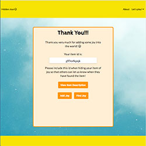

# Hidden Joys  


## Technologies Used  
- HTML, CSS, JavaScript, Node.js, Express, React, Redux, Google Maps API
- Libraries:  
    - body-parser, cors, react-dom, react-google-maps, react-redux, react-router-dom, recompose, 

## Features  
- USERS CAN HIDE NEW ITEMS:  
    - When a user wants to hide a new item, they fill out a form which includes an item title, location, image and description. The user can either use their current location or search for an address using the Google Places Library. The description field allows the user to give a little more info to help others find the item they hid.  

        After the user submits the form, they are directed to a screen thanking them for their submission. They are also given an id to include with their item so whoever finds the item can report that they found it. 

       
    

- GOOGLE MAPS
    - User can search for a specific location or use their current location to set the center of the map.

## Challenges  
- Using the Google Maps API with a React application  
    - The first challenge encountered with using the Google Maps API was figuring out how to display the map on the screen. The documentation on the Google Maps Platfrom page show how to add a map to your site using HTML and vanilla JavaScript. Since, our application is built with React, we needed to find another way to implement the api.  The solution we found to this was to install the react-google-maps library. The git repo for this library can be found at github.com/tomchentw/react-google-maps. The readme links to documentation on how to use the library.
    
    - Another problem encountered when dealing with Google Maps was creating a search box that is populated using the Google Places library. We ended up using the example for StandAloneSearchBox that was in the react-google-maps documentation. In order to use this code we had to install the recompose library which is described as 'A React utility belt for function components and higher-order components.' We also added the following code which takes the latitdue and longitude coordinates from the location and updates the global store.
    ```
        let lat = this.state.places[0].geometry.location.lat();
        let lng = this.state.places[0].geometry.location.lng();
        this.props.dispatch({
            type: 'UPDATE_LOCATION',
            location:{lat,lng}
        })
    ```
    - Getting one info window to display at a time when a marker was clicked turned out to be a bit more diffcult than expected. To handle this we had to make each Marker a class component so we could keep track of state. In the state we could keep track of whether or not the marker was the active marker and also if it was open. Since we stored this in state we were able to add a onClick handler to each marker to change these state values when a marker was clicked. Then, if a marker was open and was the active marker we would then render the info window to the map.